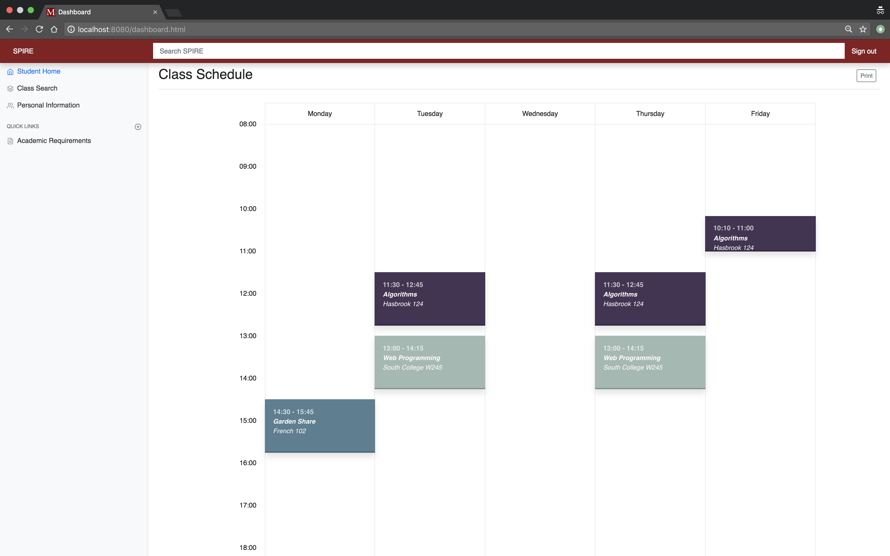
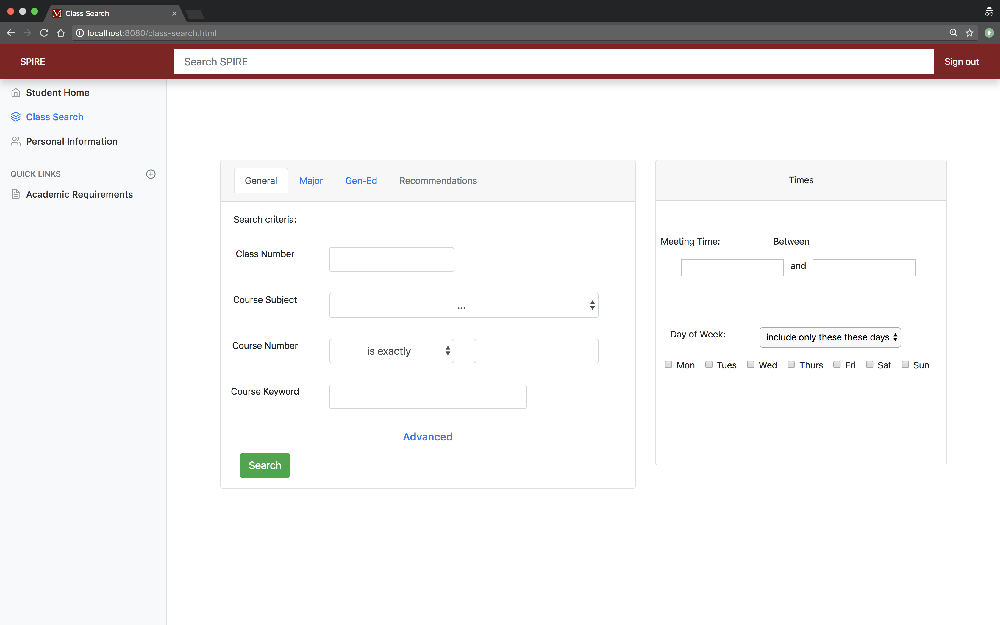
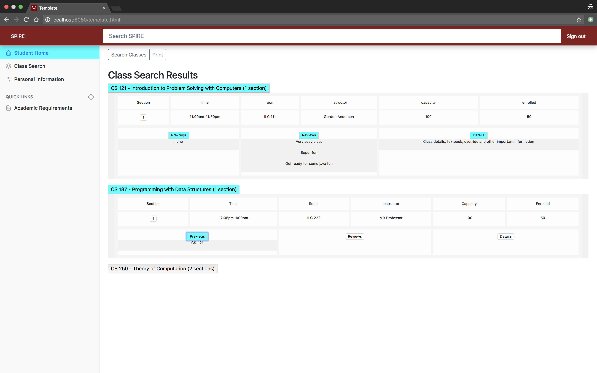
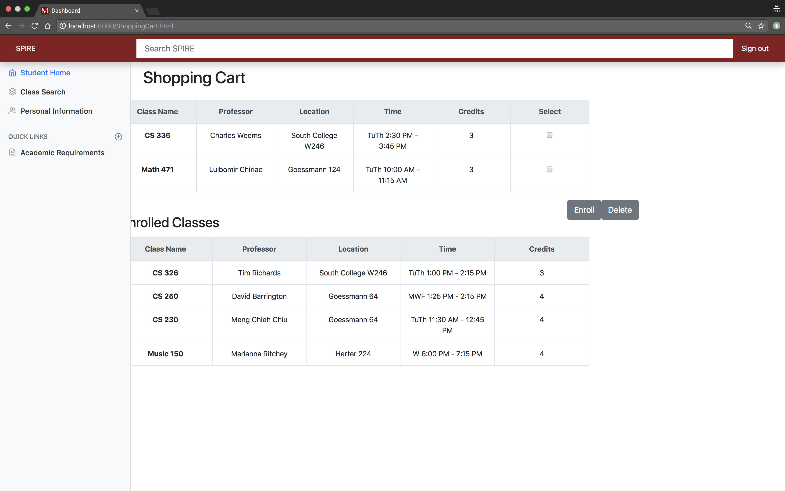

# TEAM NAME
Team team

# WEB APPLICATION NAME
Inspire

# Team Overview

* Christopher Doan, christopherdoan
* Alexander Guerriero, aguerriero1998
* Akshaya Bhattarai, theakshaya
* Patrick Casey, PCasey3
* Connor Reardon, connor1733

# Innovative Idea
	Currently SPIRE is a pretty terrible system for registering for classes and setting up your next semester's schedule. 
	SPIRE has an archaic search feature, lacks an appealing UI and it makes it difficult to easily see what you have signed up
	for already and what classes you should be signing up for based on your major and year. The goal behind this project is to
	bring the UI of SPIRE's class registration portion up to date, while making an application that is more user friendly 
	and actually aids students in choosing which classes they should be taking. Our plan currently is to add a recommended class 
	section to SPIRE, as well as refine the search features currently found within SPIRE. We will also be making it easier to view 
	your schedule, while also formatting in a more appealing manner. All of these changes will be implemented on top of a more 
	modern UI, as opposed to the more archaic interface SPIRE currently implements.

# Important Data

	This web application will aim to help students with registering for classes, viewing there schedule and leaving feedback 
	on classes. For this to work we will need a significant amount of data. Forcourses we would need data about student academics 
	like classes taken, classes enrolled, student credit balance, and credit limit and we would also implement data for each 
	class: time, location, professor, and prerequisites. This will require a dynamic listing of all the courses offered each 
	semester, with the courses themselves and their requirements and information also needing to be able to be changed.
	Alongside existing features from Spire, we are aiming to implement our own innovative features to enhance student experience. 
	We will implement a class/professor review system; this will require a catalog of data that includes a rating system (5 meat 
	birds out of 5?) and student submitted comments. We also plan to implement major specific class searches: we would need 
	to create a data based off of majors and their requirements to support this kind of search. For features like schedules and 
	our student - student schedule sharing, we would need to have data for graphic representations for schedules. Having a 
	friend social network system would also need some sort of graphing data to determine which students are friends with whom.
# User Interface

This is the Dashboard page of Inspire. This page displays the schedule of the user once they are logged in. 

The following is the class search page. It provides multiple ways to search for classes. The classic search by class name and number can be found under general tab. Users can find classes by majors and the Gen-Ed requirments under respective tabs in this page. The last one here is Recommendations. This allows users to look for recommended classes as per their prior classes, major, current schedule and other student information.  

Class Search results page displays the search results in organized manner. Each result appears as a button which can be expanded to show a grid of class information. The grid can be further expanded to view class Pre-Reqs, Reviews and other class details. The section number can be clicked to add that class in shopping cart. 

Shopping cart page has two seperate tables to display information of the classes in the shopping cart and classes enrolled. Users can enroll in a class or delete the class from enrolled list or shopping cart using the buttons provided. 

Student information page displays the personal information of an user. This page also displays the classes taken by a student in current as well as past semesters. Update information button allows users to make changes to the personal information.

