Title: Team tEaM

Subtitle: Inspire

Semester: Fall 2018

Overview: Inspire is a web application modeled after Spire. With inspire, you will get the full Spire experience with a more intuitive and user friendly experience. Inspire allows students to leave course reviews and professor reviews once they have taken a class. 

Team Members: Akshaya Bhattarai,
Alex Guerriero,
Christopher Doan,
Connor Reardon,
Patrick Casey 

User Interface:  Login View - allows Users to login or get to password reset

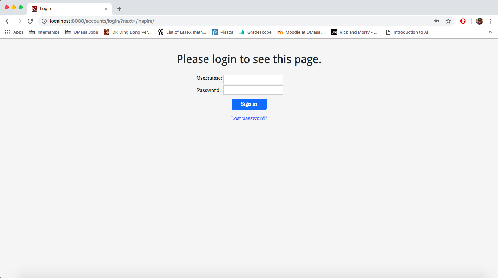

Forgot Password View- allows User to be sent password reset

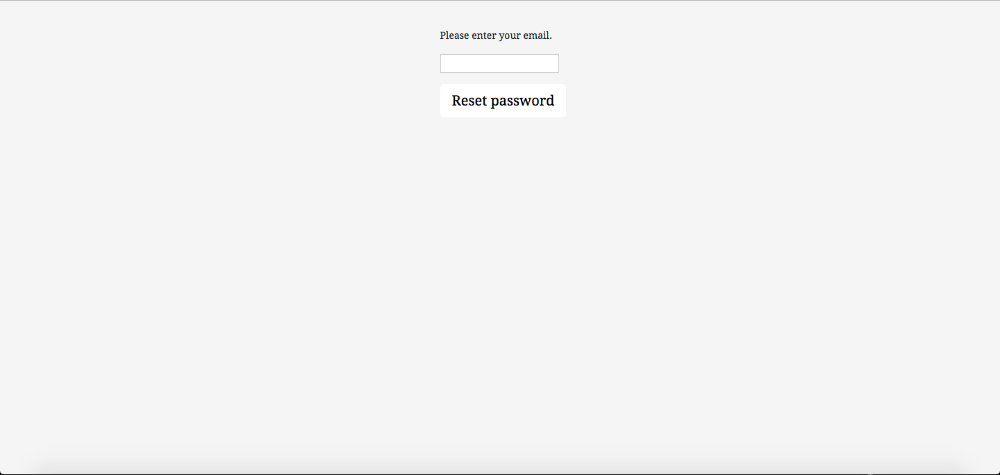

Schedule View- acts as a homepage/index for Student Users and shows a schedule based on Student's classes

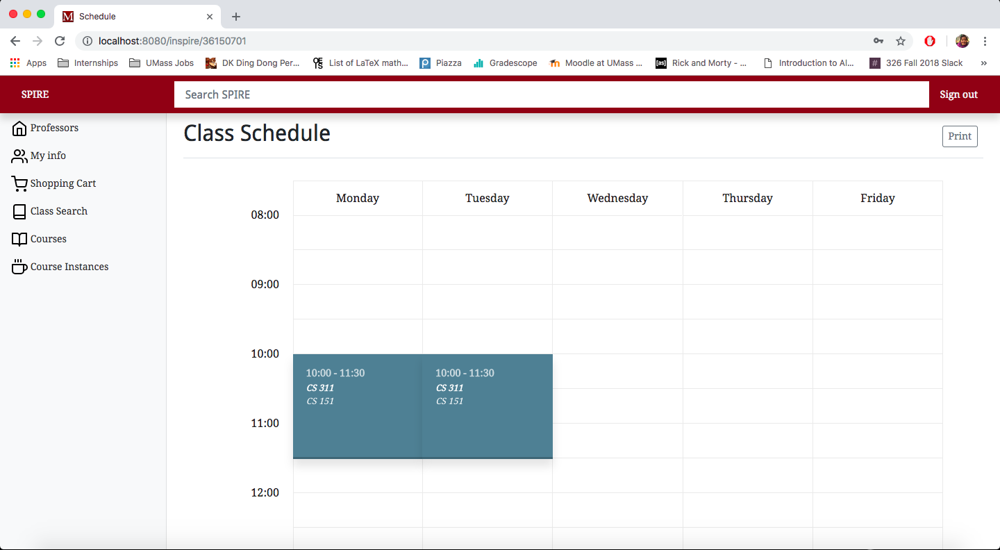

Student Info View- Shows relevant info about student like phone number, address, and courses taken. Has links to edit info, add course reviews, and add professor reviews

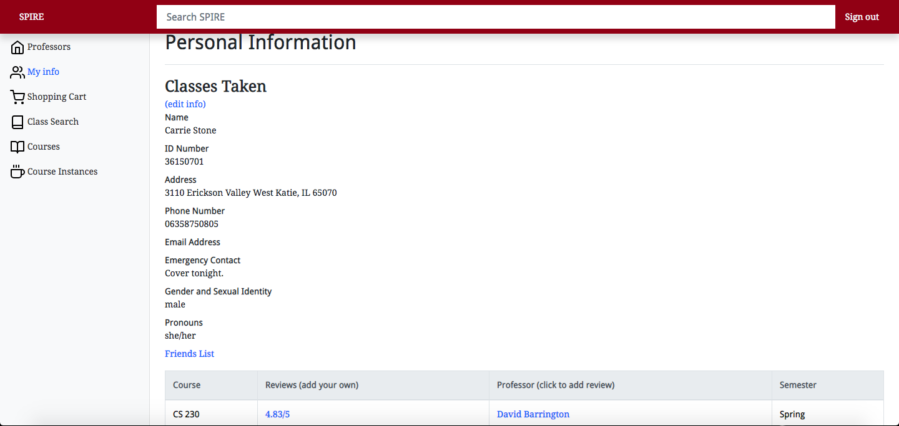

Edit Info View- allows student to edit their phone number, address, emergency contact, pronouns and gender through forms

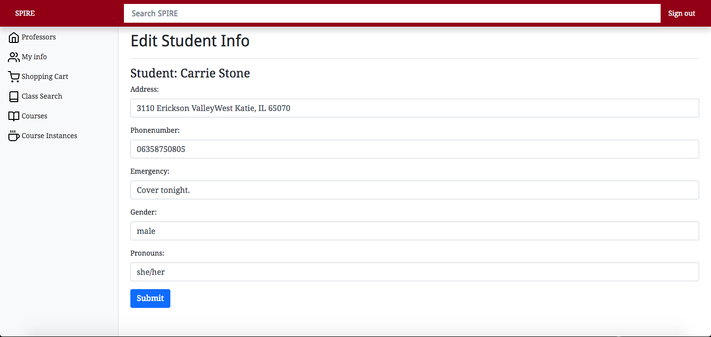

Shopping Cart View- view to show current shopping cart and currently enrolled classes- able to enroll in classes from shopping cart.

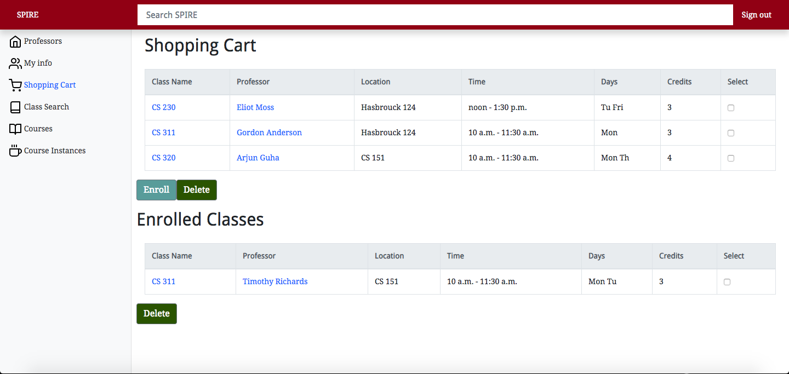

Class Search View- view for student Users to look up classes using a keyword.

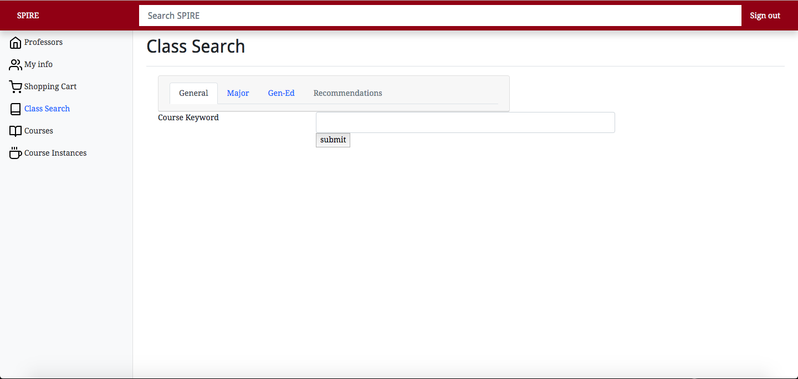

Search Result View- view that show relevant courses from class search page. Shows relevant info like professor, time, and location.

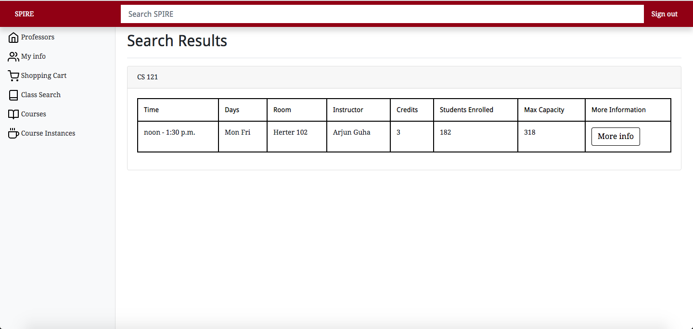

Add Course Review View- allows students to add course reviews for courses they have previously taken

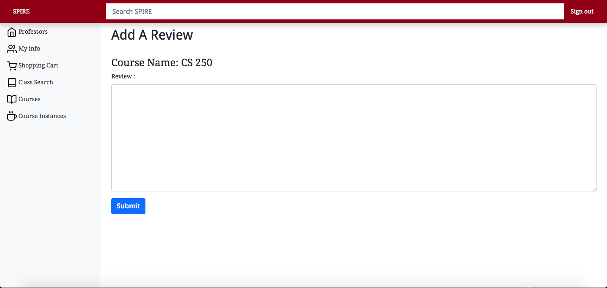

Add Professor Review View- allows students to add professor reviews for professors they have had for previously taken classes.

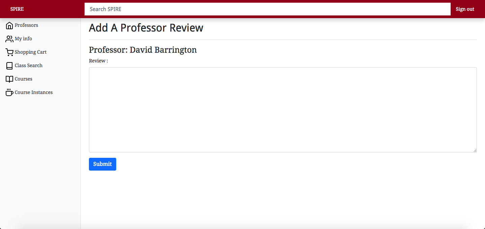

 Course List View- view to show directory of all courses
 
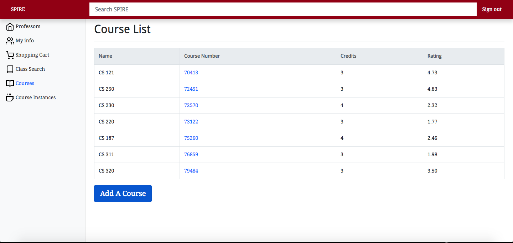
 
 Add Course View- only accessible by admin/professor Users. allows for courses to be added.
 
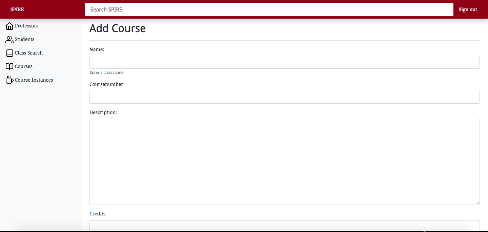

Course Info View- shows a course's info including description, credits, and reviews.

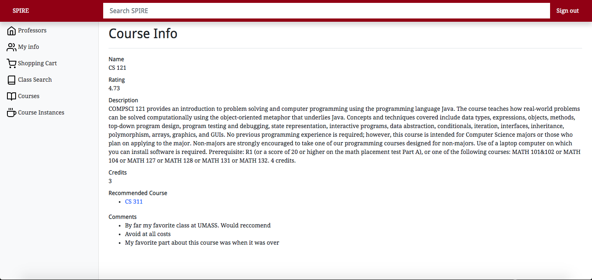

Course Instance List- shows a list of the currenty course instances offered the semester.

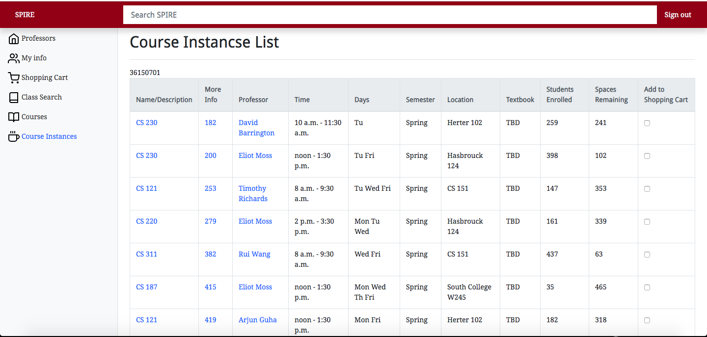

Course Instance Info- shows info on course instance - incuding enrollment, professor, time, location.

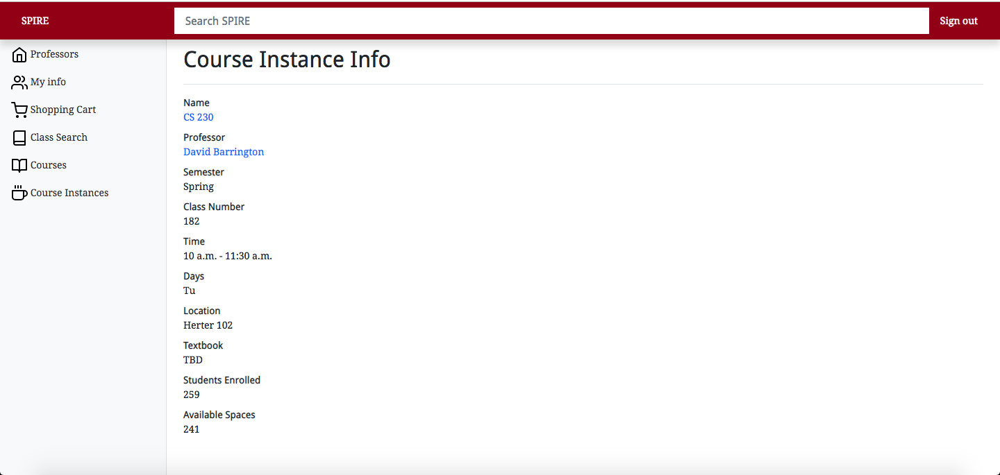
 
 

Data Model: A final up-to-date diagram of your data model including a brief description of each of the entities in your model and their relationships. 

URL Routes/Mappings:

|                Path                |                                                                  Description                                                                 |
|:----------------------------------:|:--------------------------------------------------------------------------------------------------------------------------------------------:|
| accounts/login                     | When user is not logged-in this is the first url they see. Login required to access app                                                      |
| accounts/password_reset            | From the login page- if a user forgets password they can go to this page.                                                                    |
| accounts/logout                    | From any page in the app, a user can logout to get to this page. Shows they are logged out                                                   |
| inspire/<int:pk>                   | Default homepage for student User after login                                                                                                |
| inspire/class-search               | Sidebar component that is used to start class searches- accessible by all Users                                                              |
| inspire/search-results             | Accessed from class-search to show search results- accessible by all Users                                                                   |
| inspire/students                   | Sidebar component and shows list of all students- accessible by admins Users only                                                            |
| inspire/courses                    | Sidebar component shows courses- accessible by all Users                                                                                     |
| inspire/course-instances           | Sidebar component shows course instances- accessible by all Users                                                                            |
| inspire/course/<int:pk>            | Routed from courses list- shows info on the course indicated by its pk course number. Accessible by all Users                                |
| inspire/course-instance/<int:pk>   | Routed from course instances list- shows info on course instance indicated by its pk class number. accessible from all Users                 |
| inspire/course-review/<int:pk>     | Routed from student info page - adds a review for course by its pk course number. Accessible by student Users                                |
| inspire/course-review/success      | Routed from course-review - shows successful review added. Accessible by student Users                                                       |
| inspire/professors                 | Sidebar component shows list of professors - accessible by all Users                                                                         |
| inspire/professor/<str:pk>         | Routed from professors list- shows information on professor. Accessible by all Users                                                         |
| inspire/professor/<str:pk>/review  | Routed from student info page- adds a review for professor by their name. Accessible by student Users                                        |
| inspire/professor/<str:pk>/success | Routed from professor review page- shows successful review added. Accessible by student Users                                                |
| inspire/shopping-cart/<int:pk>     | Sidebar component- shows unique shopping cart to student identified by their pk id number. Accessible by single student User                 |
| inspire/student-info/<int:pk>      | Sidebar component- shows unique student info page for student identified by their pk id number. Accessible by single student and admin Users |
| inspire/student-info/<int:pk>/edit | Accessed from student info page - able to edit info on student. Accessed by single student and admins.                                       |
| inspire/friends/<int:pk>           | Accessed from student info page- shows friends of student. Accessed by single student and admin Users                                        |

Authentication/Authorization: A final up-to-date description of how users are authenticated and any permissions for specific users (if any) that you used in your application. You should mention how they relate to which UI views are accessible.

Team Choice: You should briefly mention your team choice component for your application. You should highlight any additions to your application that are part of your team choice, such as, URL routes, UI views, data model, to make it clear what your team choice addition is. 

Conclusion: A conclusion describing your team’s experience in working on this project. This should include what you learned through the design and implementation process, the difficulties you encountered, what your team would have liked to know before starting the project that would have helped you later, and any other technical hurdles that your team encountered.
